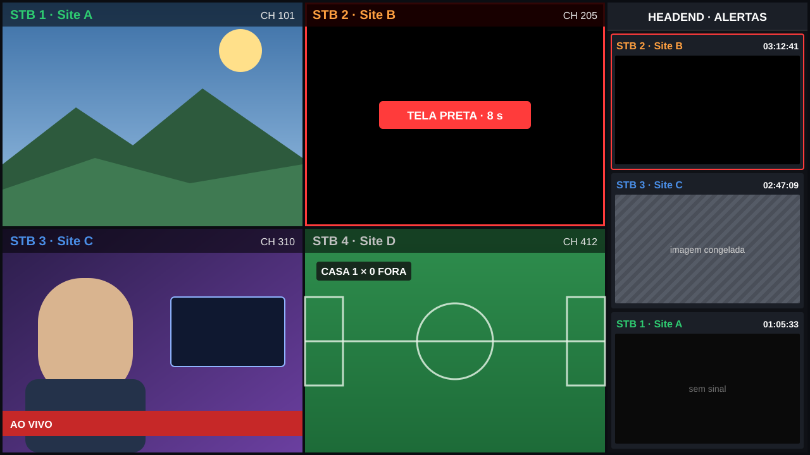
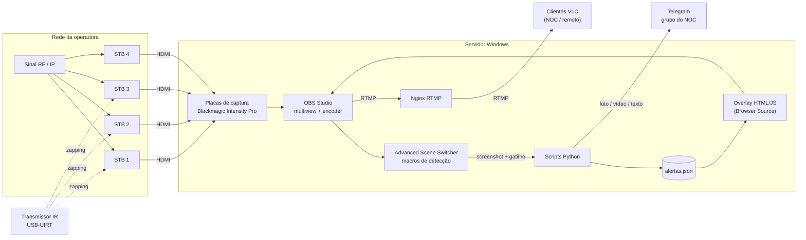
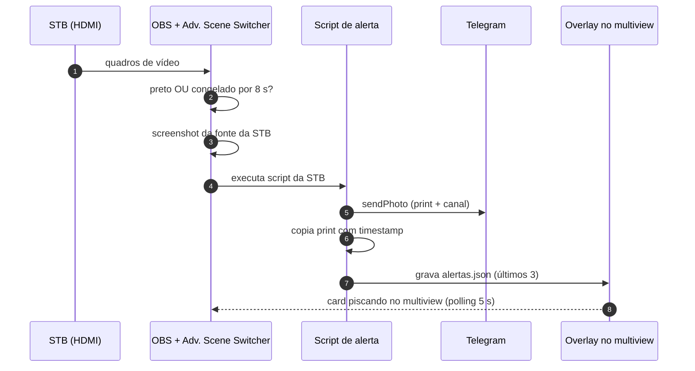
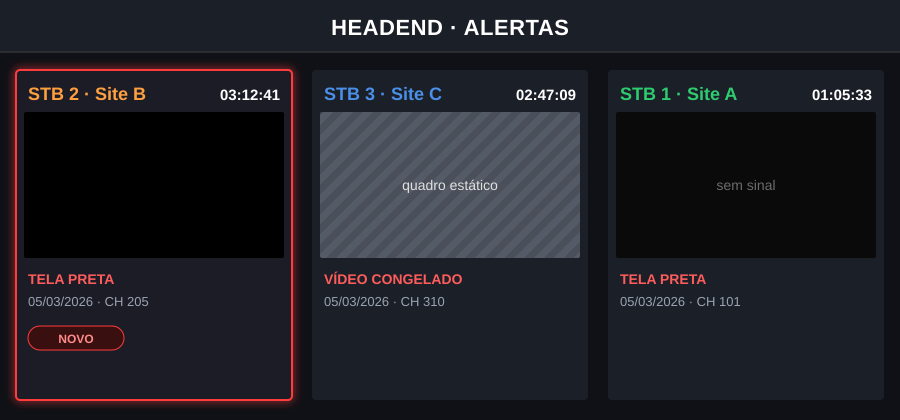

# STB Lineup Validator

**Validação contínua de lineup em Set-Top Boxes reais, com detecção automática de tela preta e vídeo congelado, evidência em vídeo e alerta no Telegram — usando OBS Studio e hardware de baixo custo.**

> Este repositório é um **showcase**: documenta a arquitetura, a lógica de detecção e as decisões de operação de uma solução em uso real num headend de TV por assinatura. Nomes de operadora, sites, IPs e credenciais foram removidos.

Mockup ilustrativo do multiview: quatro STBs em mosaico, uma em tela preta sob alerta, e o painel com os últimos eventos.

---

## O problema

Um headend pode estar 100% verde no monitoramento — SNMP ok, TS sem erros de CC, bitrate estável — e mesmo assim o assinante ver **tela preta**. Isso acontece porque várias falhas só aparecem **depois** do decodificador:

- canal com mapeamento errado no lineup do STB;
- falha de descrambling / direitos de acesso;
- serviço presente no transport stream, mas sem vídeo decodificável;
- slate ou imagem congelada injetada a montante;
- problemas de middleware, guia ou sintonia que só o STB revela.

Plataformas comerciais de monitoramento pós-decodificador (probes com STB, sistemas de compliance) resolvem isso, mas custam caro por ponto monitorado.

## A solução

Simular um assinante real: **STBs de produção** ligados por HDMI a placas de captura, com o **OBS Studio** fazendo o papel de multiview, analisador de vídeo, gravador de evidências e encoder — e um conjunto pequeno de scripts para notificar a equipe.

## O que ela detecta

| Evento | Como é detectado | Tempo mínimo |
|---|---|---|
| **Tela preta** | ≥ 95 % dos pixels próximos de preto (tolerância de cor 0,18) | 8 s contínuos |
| **Vídeo congelado / static screen** | Similaridade ≥ 99,9 % entre quadros consecutivos | 8 s contínuos |
| **Canal indisponível / falha de sintonia** | Resulta em uma das condições acima durante o zapping | — |
| **Falha recorrente** | 3 alertas da mesma STB numa janela curta → supressão + evidência em vídeo | ~36 s |

As duas condições de imagem são combinadas com **OU**: qualquer uma sustentada por 8 s dispara o alerta. Detalhes em [docs/02-deteccao-de-falhas.md](docs/02-deteccao-de-falhas.md).

## Fluxo de um alerta

## Destaques técnicos

- **Detecção sem código de visão computacional próprio** — toda a análise de imagem roda dentro do OBS, via macros do plugin *Advanced Scene Switcher*, por fonte de captura.
- **Anti-flood com máquina de estados** — alertas isolados não acumulam; três em sequência pausam a STB por 15 min, gravam um clipe de evidência, enviam ao Telegram e reativam sozinhos ([detalhes](docs/02-deteccao-de-falhas.md#anti-flood-contagem-pausa-e-reativação)).
- **Evidência em vídeo, não só print** — clipes curtos gravados pelo próprio OBS na hora do problema e uma rotina de "prova de vida" a cada 15 min.
- **Painel de alertas no próprio stream** — overlay HTML/CSS/JS consumindo um JSON local; quem assiste ao multiview via RTMP vê os últimos alertas sem abrir outro sistema.
- **Operação 24x7 sem intervenção** — boot automático da pilha, restart programado do stream, reboot controlado que evita o *safe mode* do OBS ([detalhes](docs/05-operacao-24x7.md)).
- **Zapping por infravermelho** — sequências de canais com tempo de permanência configurável, enviadas por USB-UIRT ([detalhes](docs/04-zapping-ir.md)).

## Painel de alertas

Mockup ilustrativo — em produção os prints são as capturas reais da STB no momento da falha.

Cada card mostra a STB (com cor própria), o horário e o print do momento da falha. Alertas com menos de 5 minutos piscam em vermelho. O painel é uma página estática servida localmente e carregada como *Browser Source* no OBS — ver [docs/03-alertas-e-overlay.md](docs/03-alertas-e-overlay.md).

## Stack

| Camada | Tecnologia |
|---|---|
| Captura HDMI | Blackmagic Intensity Pro + Desktop Video |
| Composição, análise e encoding | OBS Studio 32.x (x264 CBR, `zerolatency`) |
| Regras de detecção | Plugin Advanced Scene Switcher (macros) |
| Distribuição | Nginx com módulo RTMP |
| Automação e integrações | Python 3, PowerShell, Batch |
| Notificação | Telegram Bot API (`sendPhoto`, `sendVideo`, `sendMessage`) |
| Painel | HTML + CSS + JavaScript (Browser Source) |
| Controle dos STBs | USB-UIRT (infravermelho) |

## Por que baixo custo

- Software 100 % gratuito/open source na cadeia de vídeo (OBS, plugin, Nginx, Python).
- Um único servidor Windows com placas de captura atende **4 STBs** simultâneos.
- Roda em hardware comum ou reaproveitado; não exige GPU dedicada (x264 `veryfast` a ~1,5 Mbps).
- Notificação sem custo de licença (Telegram).

## Documentação

| # | Documento | Conteúdo |
|---|---|---|
| 1 | [Arquitetura](docs/01-arquitetura.md) | Componentes, rede, portas, cena do OBS |
| 2 | [Detecção de falhas](docs/02-deteccao-de-falhas.md) | Macros, limiares, anti-flood, rotinas |
| 3 | [Alertas e overlay](docs/03-alertas-e-overlay.md) | Telegram, formato do `alertas.json`, painel |
| 4 | [Zapping IR](docs/04-zapping-ir.md) | USB-UIRT, sequências de canais |
| 5 | [Operação 24x7](docs/05-operacao-24x7.md) | Boot, restart programado, reboot controlado |
| 6 | [Lições aprendidas](docs/06-licoes-aprendidas.md) | O que funcionou, o que mudou, próximos passos |

## Casos de uso

- Headends IPTV, CATV e FTTH
- Validação de lineup após mudanças de grade ou de mapeamento
- Laboratórios de homologação de STB e middleware
- NOC: confirmação visual da experiência do assinante

## Autor

**Daniel Colona** — engenharia de headend, broadcast e telecom.
[github.com/danielColona](https://github.com/danielColona)

Implantação, customização ou integração desta solução em outro ambiente: abra uma *Issue* neste repositório.

## Licença

Documentação licenciada sob [Creative Commons Atribuição 4.0 (CC BY 4.0)](LICENSE). Marcas citadas pertencem aos respectivos donos.
