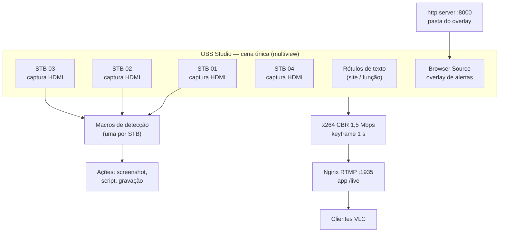

# 1. Arquitetura

[← Voltar ao README](../README.md)

## Visão geral

A solução roda em **um servidor Windows** com placas de captura HDMI. Cada STB é uma fonte de vídeo independente dentro de uma única cena do OBS, que funciona ao mesmo tempo como:

1. **multiview** — mosaico 2×2 das STBs com rótulos e painel de alertas;
2. **analisador** — macros por fonte verificam preto e congelamento;
3. **gravador** — clipes curtos de evidência sob demanda;
4. **encoder** — o mosaico é enviado por RTMP para visualização remota.



## Componentes

| Componente | Papel | Observações |
|---|---|---|
| **STBs** | Assinante simulado | Equipamentos de produção, cada um em um ponto/site diferente da rede |
| **Blackmagic Intensity Pro** | Captura HDMI → DirectShow | Driver *Desktop Video*; cada placa vira uma fonte "Dispositivo de captura de vídeo" no OBS |
| **OBS Studio 32.x** | Multiview, análise, gravação, encoding | Inicia já transmitindo (`--startstreaming`) |
| **Advanced Scene Switcher** | Motor de regras | Condições de vídeo por fonte, contadores de execução, temporizadores e agendamentos |
| **Scripts Python** | Integração | Envio ao Telegram e atualização do `alertas.json` |
| **Overlay HTML/CSS/JS** | Painel de alertas | Servido por `python -m http.server` e carregado como Browser Source |
| **Nginx + módulo RTMP** | Distribuição | Recebe o stream do OBS e entrega aos clientes VLC |
| **USB-UIRT** | Controle remoto IR | Zapping automático de canais nas STBs |
| **Telegram** | Canal de notificação | Grupo do NOC recebe prints, vídeos e mensagens de estado |

## Cena do OBS

Uma única cena contém:

- **4 fontes de captura** (`STB 01` … `STB 04`), dispostas em mosaico;
- **rótulos de texto** sobre cada quadrante, identificando o site/ponto de cada STB;
- o **Browser Source** com o painel de alertas.

Manter tudo numa cena só é deliberado: as macros analisam **a fonte**, não a cena, então o mosaico pode ser rearranjado sem afetar a detecção, e o stream RTMP já sai com o painel embutido.

## Encoding e distribuição

| Parâmetro | Valor | Motivo |
|---|---|---|
| Encoder | x264 | Sem dependência de GPU |
| Controle de taxa | CBR 1.500 kbps | Banda previsível para acesso remoto |
| Preset / tune | `veryfast` / `zerolatency` | Baixa latência e CPU moderada |
| Intervalo de keyframe | 1 s | Cliente VLC entra rápido no stream |
| Reconexão | ativa, 25 tentativas | Tolera reinícios do Nginx |

O Nginx expõe:

| Porta | Uso |
|---|---|
| `1935/tcp` | RTMP — aplicação `live` (`live on`, `record off`) |
| `8080/tcp` | Estatísticas (`/stat`, `rtmp_stat all`) |

O OBS de saída é **vinculado a uma interface de rede específica** (*Bind IP*). Em uma das implantações o servidor tem duas interfaces — rede interna do headend e um link de internet separado — e o stream é publicado pela interface interna, permitindo acesso remoto sem expor o OBS diretamente.

## Estrutura de pastas em produção (anonimizada)

```text
C:\OBS_Alertas\            painel: overlay.html, style.css, script.js, alertas.json + prints
C:\nginx-rtmp\             Nginx com módulo RTMP
<pasta de vídeos>\STB1\    scripts da STB 1, último screenshot, clipes de evidência
<pasta de vídeos>\STB2\    idem STB 2
<pasta de vídeos>\STB3\    idem STB 3
```

Cada STB tem sua própria pasta para que screenshot, clipe e script não colidam quando duas STBs alarmam ao mesmo tempo.
