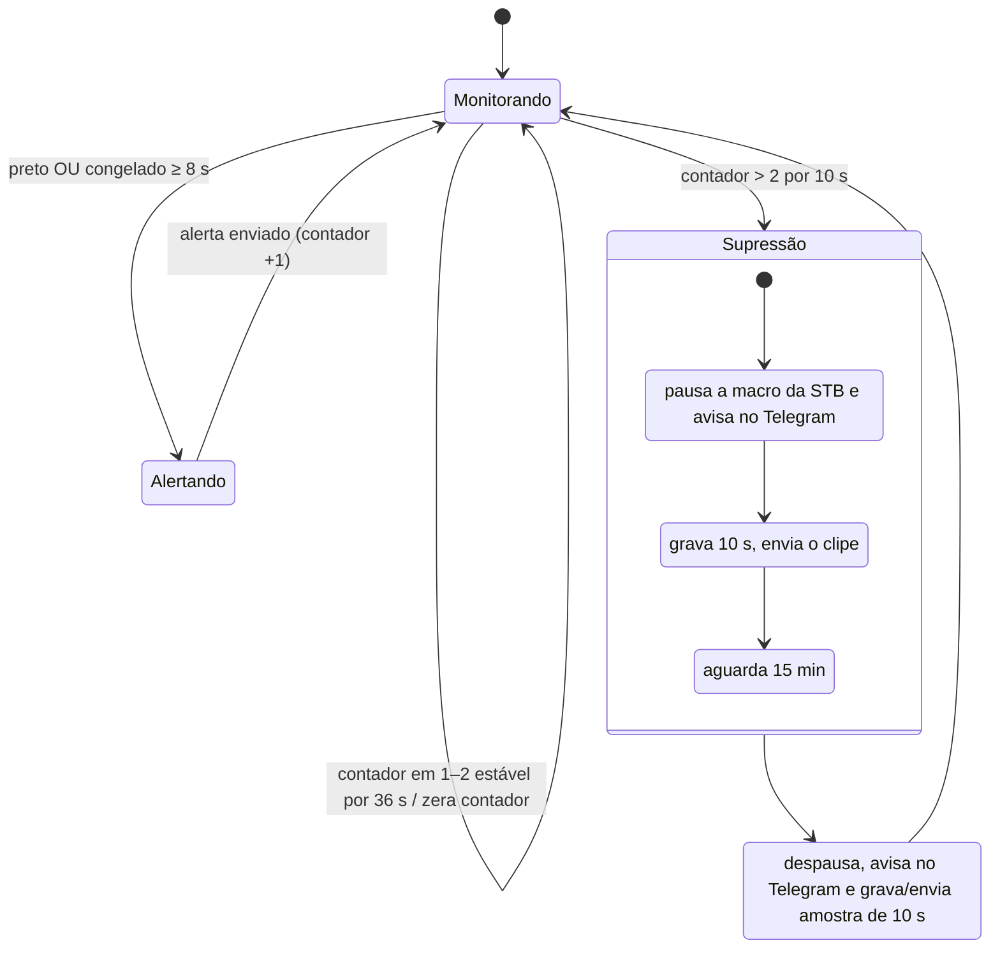

# 2. Detecção de falhas

[← Voltar ao README](../README.md)

Toda a lógica de detecção vive em **macros do plugin Advanced Scene Switcher** dentro do OBS. Não há serviço externo analisando vídeo: o OBS já tem os quadros decodificados em memória, e o plugin oferece condições de vídeo prontas por fonte.

São 11 macros, em quatro famílias:

| Família | Macros | Função |
|---|---|---|
| Detecção | `Macro STB1..3` | Detecta preto/congelado e dispara o alerta |
| Contagem | `Contagem STB1..3` | Detecta alertas recorrentes e aplica supressão |
| Zeragem | `ZerarCont STB1..3` | Zera o contador quando o alerta foi isolado |
| Rotinas | `Rotina`, `Reboot TX` | Prova de vida periódica e restart programado do stream |

---

## Macro de detecção (uma por STB)

### Condições

Duas condições de vídeo sobre a **fonte** da STB, combinadas com **OU**:

| # | Condição | Parâmetros | Duração |
|---|---|---|---|
| 1 | **Cor** — a imagem corresponde a uma cor | cor `#000000`, tolerância de cor `0,18`, correspondência mínima `95 %` dos pixels | por pelo menos **8 s** |
| 2 | **Não mudou** — a imagem não se alterou | similaridade `≥ 99,9 %` | por pelo menos **8 s** |

- A condição 1 pega **tela preta**, incluindo pretos "sujos" (logo pequeno, ruído, legenda residual), graças à tolerância de cor e ao limiar de 95 %.
- A condição 2 pega **vídeo congelado** e **static screen** (slate fixo, tela de "sem sinal" do STB, menu travado).
- A janela de 8 s filtra eventos legítimos curtos: fades, transições, cortes para preto em intervalos comerciais.

### Ações

1. **Screenshot** da fonte da STB → arquivo fixo na pasta da STB.
2. **Executa o script de alerta** da STB, que:
   - pega o screenshot mais recente;
   - envia ao Telegram com legenda identificando a STB/canal;
   - copia o print com timestamp para a pasta do painel;
   - insere o alerta no topo do `alertas.json` (mantendo os 3 últimos).

Ver [03 — Alertas e overlay](03-alertas-e-overlay.md).

---

## Anti-flood: contagem, pausa e reativação

Um canal fora do ar por uma hora geraria um alerta a cada poucos segundos. Para evitar isso, cada STB tem um par de macros que observa **quantas vezes a macro de detecção executou**.

### `Contagem STBn`

**Condição:** a macro `Macro STBn` executou **mais de 2 vezes** (contador mantido por 10 s).

**Ações, em ordem:**

| # | Ação | Mensagem / arquivo |
|---|---|---|
| 1 | Pausa `Macro STBn` | — |
| 2 | Telegram (texto) | "A macro *STB n* foi pausada durante 15 min, alarmes recorrentes." |
| 3 | Zera o contador de `Macro STBn` | — |
| 4 | Define pasta e nome de gravação; inicia gravação | clipe de evidência |
| 5 | Aguarda 10 s; para a gravação | — |
| 6 | Aguarda 15 s (fechamento do arquivo); envia o vídeo | "🔄 Evidência 🚨 Verificação *STB n*" |
| 7 | **Aguarda 15 minutos** | — |
| 8 | Despausa `Macro STBn` | — |
| 9 | Telegram (texto) | "A macro *STB n* foi reativada." |
| 10 | Grava 10 s, aguarda, envia o vídeo | "🔔 Amostra de vídeo — reativação" |

O resultado para o NOC é uma sequência curta e legível no Telegram: *print → print → print → "pausada" → vídeo de evidência → (15 min) → "reativada" → vídeo atual*. O vídeo de reativação mostra se o problema persiste sem precisar abrir o multiview.

### `ZerarCont STBn`

**Condição:** o contador de `Macro STBn` está em **1 ou 2** e permanece assim por **36 s** (70 s para uma das STBs — a janela é ajustável por ponto monitorado).

**Ação:** zera o contador.

Assim, um alerta isolado (um corte longo para preto, por exemplo) não "soma" com outro alerta isolado horas depois. Só três alertas **próximos** caracterizam falha recorrente.

---

## Rotinas

### `Rotina` — prova de vida

| Condição | Ações |
|---|---|
| Temporizador de **15 min**, recorrente | Grava **15 s** do multiview, aguarda o fechamento do arquivo e envia ao Telegram |

Silêncio no Telegram é ambíguo: pode significar "tudo bem" ou "o sistema parou". O clipe periódico elimina essa dúvida e ainda serve de amostra visual de todas as STBs de uma vez.

### `Reboot TX` — restart programado do stream

| Condição | Ações |
|---|---|
| Horário agendado de madrugada | Para o streaming → aguarda 7 s → inicia o streaming → avisa no Telegram: "Reboot TX realizado, efetuar STOP/PLAY nos clientes VLC" |

Sessões RTMP de dias seguidos acumulam deriva de timestamp e latência nos clientes. Um restart curto num horário de baixo uso mantém o stream "fresco".

---

## Escolha dos limiares

| Parâmetro | Valor | Raciocínio |
|---|---|---|
| Duração da condição | 8 s | Acima da maioria dos cortes para preto e transições de programação; abaixo do tempo em que o assinante desiste do canal |
| Tolerância de cor | 0,18 | Aceita pretos com ruído de captura e compressão |
| Correspondência mínima | 95 % | Permite elementos pequenos (logo do canal, relógio do STB) sem mascarar a falha |
| Similaridade para "não mudou" | 99,9 % | Ruído de captura HDMI mantém quadros congelados ligeiramente abaixo de 100 % |
| Gatilho de recorrência | > 2 execuções | 3 alertas próximos = problema real, não transitório |
| Pausa | 15 min | Tempo para a equipe agir sem receber dezenas de prints repetidos |
