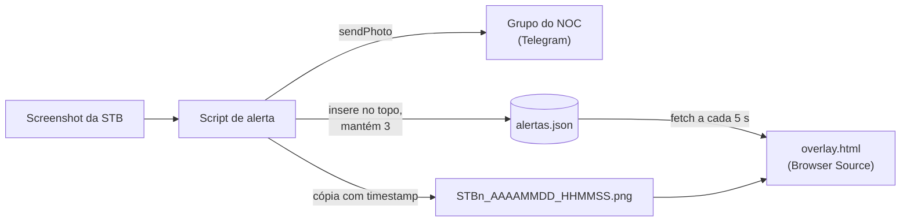

# 3. Alertas e overlay

[← Voltar ao README](../README.md)

Cada alerta segue por dois caminhos ao mesmo tempo: **Telegram**, para quem está fora da sala, e o **painel no multiview**, para quem está olhando o stream.



## Mensagens no Telegram

O bot usa três métodos da Bot API:

| Método | Quando | Conteúdo |
|---|---|---|
| `sendPhoto` | Cada detecção | Print da STB + legenda "🚨 Verificar canal *X*" |
| `sendVideo` | Supressão, reativação e rotina de 15 min | Clipe curto gravado pelo OBS (o arquivo é apagado após envio bem-sucedido) |
| `sendMessage` | Mudanças de estado | Macro pausada / reativada / restart do stream |

Cada STB tem uma cor/emoji próprio nas mensagens, o que permite identificar a origem do alerta só pela notificação no celular.

> **Credenciais:** token do bot e `chat_id` devem ficar fora do código — variáveis de ambiente ou arquivo de configuração local fora do controle de versão.

## Formato do `alertas.json`

Lista ordenada do mais recente para o mais antigo, limitada a **3 itens**:

```json
[
  {
    "fonte": "STB2 - Site B",
    "tipo": "VIDEO CONGELADO",
    "hora": "05/03/2026 15:11:33",
    "imagem": "STB2_20260305_151133.png"
  }
]
```

| Campo | Descrição |
|---|---|
| `fonte` | Identificação da STB exibida no card; o prefixo `STBn` define a cor |
| `tipo` | Tipo do evento |
| `hora` | Horário local do disparo |
| `imagem` | Nome do print copiado para a pasta do painel |

Quando um alerta sai da lista, o print correspondente é apagado — a pasta do painel nunca cresce além de 3 imagens.

## Painel (Browser Source)


- Página estática (`overlay.html` + `style.css` + `script.js`) servida por `python -m http.server 8000` na pasta do painel.
- O OBS carrega `http://localhost:8000/overlay.html` como Browser Source.
- A cada **5 s** o script busca `alertas.json` com um parâmetro anti-cache e redesenha os cards.
- Cada STB tem uma cor fixa no nome da fonte.
- Alertas com menos de **5 minutos** recebem borda vermelha com brilho pulsante.

### Por que um JSON em disco e não um banco ou websocket

- O script de alerta já roda localmente e termina em menos de um segundo; gravar um arquivo é o mecanismo mais simples possível.
- O Browser Source do OBS é um Chromium completo — `fetch` com polling resolve sem servidor de aplicação.
- Em caso de falha, o estado é inspecionável abrindo um arquivo de texto.

## Evidência em vídeo

As gravações usam o próprio OBS, comandado pelas macros:

1. muda pasta e nome de arquivo da gravação para a STB em questão;
2. inicia a gravação, aguarda 10–15 s, para;
3. aguarda 15 s para o arquivo ser finalizado;
4. o script envia o vídeo e apaga o arquivo local.

Como a gravação é do **multiview**, o clipe mostra também as outras STBs — útil para distinguir falha de um canal/ponto de falha geral.
