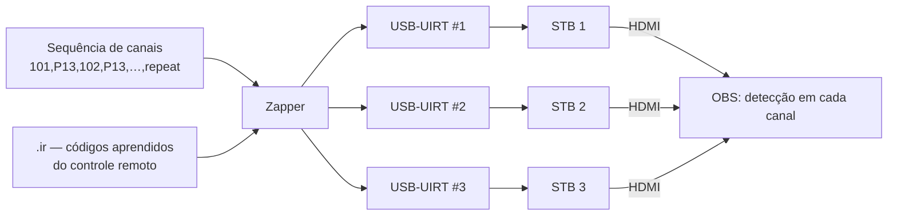

# 4. Zapping por infravermelho

[← Voltar ao README](../README.md)

Validar o **lineup** — e não só um canal — exige trocar de canal. Para isso a solução usa transmissores **USB-UIRT**, um por STB (ou um com múltiplas saídas), emitindo os mesmos códigos do controle remoto do assinante.



## Códigos IR

- Os códigos do controle remoto do STB são **aprendidos** pelo próprio USB-UIRT e salvos em arquivos `.ir` (um comando por tecla: dígitos, `ChUp`, `ChDn`, `Exit`, `Guide`, `Power`…).
- Há um arquivo de códigos por modelo de controle remoto, de modo que STBs de fabricantes diferentes coexistem.

## Formato da sequência de zapping

Uma sequência é uma lista separada por vírgulas, alternando **canal** e **pausa**:

```text
101,P13,102,P13,105,P13,110,P13,…,560,P13,repeat
```

| Token | Significado |
|---|---|
| `101` | Digita o canal 101 (envia os dígitos `1`, `0`, `1`) |
| `P13` | Permanece **13 s** no canal |
| `repeat` | Volta ao início da lista |

O tempo de permanência é dimensionado a partir da detecção:

```text
tempo de troca de canal do STB  +  janela de detecção (8 s)  +  margem  ≤  P13
```

Ou seja, se o canal sintonizar preto ou congelado, ele fica tempo suficiente na tela para a macro disparar **antes** do próximo zap. Para STBs mais lentos (ou canais HD com zap mais demorado) usa-se `P17`.

Com ~35 canais por lista e 13 s por canal, uma volta completa no lineup leva cerca de **8 minutos** — cada canal é verificado várias vezes por hora, em cada STB, sem intervenção humana.

## Driver e integração

- O USB-UIRT usa um chip FTDI; no Windows 10/11 64-bit funciona com o driver FTDI atual e a DLL `uuirtdrv.dll`.
- A integração em Python carrega a DLL via `ctypes`, lê o `.ir`, e suporta **múltiplos dispositivos** (cada um com seu conjunto de comandos) e **sequências automáticas** definidas em um JSON de configuração.

## Quando o alerta acontece durante o zapping

Como a legenda do Telegram e o print mostram **qual canal estava na tela**, o alerta de tela preta durante o zapping aponta diretamente o canal problemático do lineup — que é exatamente a informação que o monitoramento de transport stream não entrega quando o problema está no mapeamento ou nos direitos do STB.
