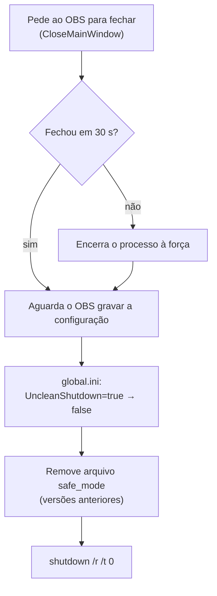

# 5. Operação 24x7

[← Voltar ao README](../README.md)

Um sistema de monitoramento que precisa ser monitorado não ajuda. Esta seção descreve como a solução sobe, se mantém e reinicia sozinha.

## Sequência de boot

Na inicialização da sessão do Windows, um script sobe a pilha inteira na ordem certa:

| Etapa | Motivo |
|---|---|
| Painel e Nginx **antes** do OBS | O Browser Source e a saída RTMP precisam encontrar seus destinos já disponíveis |
| Remover marcador de safe mode | Evita o diálogo de "modo de segurança" que travaria o OBS esperando um clique |
| `--startstreaming` | O OBS já sobe transmitindo, sem interação |
| Bloquear a estação após 60 s | Sessão logada (necessária para captura e Browser Source), mas console protegido |

## Restart programado do stream

Via macro `Reboot TX` (ver [Detecção](02-deteccao-de-falhas.md#reboot-tx--restart-programado-do-stream)): de madrugada o OBS para e reinicia o streaming, e avisa o NOC para reconectar os clientes VLC.

## Reboot controlado do servidor

Reiniciar o Windows com o OBS aberto é a causa mais comum de o sistema **não voltar sozinho**: o OBS detecta encerramento sujo e abre em *safe mode*, pedindo confirmação.

O reboot controlado resolve isso em três passos:

| Detalhe | Por quê |
|---|---|
| Fechamento gracioso primeiro | Garante que gravações em andamento sejam finalizadas e a configuração seja salva |
| Corrigir `UncleanShutdown` no `global.ini` | A partir do OBS 32.x o flag de encerramento sujo fica no `global.ini`, não mais em um arquivo `safe_mode` separado |
| Tratar os dois mecanismos | O mesmo script funciona em versões antigas e novas do OBS |

## Manutenção do hardware

- Backup dos drivers do Windows (placas de captura, RAID, FTDI do USB-UIRT) antes de upgrades de sistema — reinstalar drivers de captura é a parte mais demorada de uma recuperação.
- Backup da coleção de cenas do OBS e da configuração do Advanced Scene Switcher (exportação das macros) a cada mudança de regra.

## Checklist operacional

| Verificação | Onde |
|---|---|
| Clipe de rotina chegando a cada 15 min | Telegram |
| Stream ativo e com bitrate estável | `http://<servidor>:8080/stat` |
| Painel atualizando | Multiview via VLC |
| STBs com sinal | Multiview — quadrante preto em todas as STBs indica falha de captura, não de canal |
